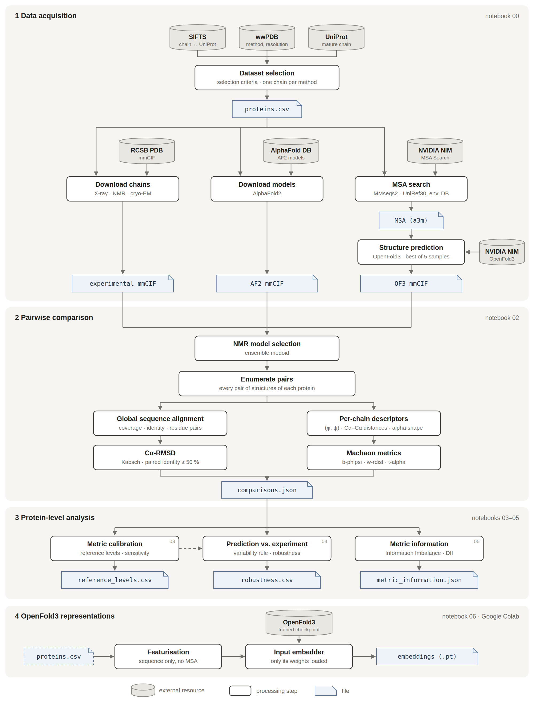

# Can a predicted protein structure stand in for an experimental one?

MSc thesis · Supervisors: Giannis Emiris, Panagiotis Kakoulidis

Structures of the same protein determined by different experimental methods (X-ray crystallography,
solution NMR, cryo-EM) are not identical. This project uses that spread as a reference: for every
protein in a dataset built from public resources, it asks whether the AlphaFold2 and OpenFold3
predictions are as close to the experimental structures as these are to each other. Distances are
measured with the three structural metrics of Machaon (b-phipsi, w-rdist, t-alpha), which compare
per-chain descriptors without residue correspondence, alongside Cα-RMSD. Before the predictions are
assessed, the metrics are calibrated: the implementation is checked against Machaon, the factors other
than conformation that change their values are measured, and reference levels give their scale. The methods and limitations are described in [METHODS.md](METHODS.md).



**Pipeline.** (1) Proteins with NMR and cryo-EM structures are selected from SIFTS, the wwPDB and
UniProt, and their experimental chains, AlphaFold2 models and OpenFold3 predictions are retrieved.
(2) Every pair of structures of a protein is compared with the three Machaon metrics and Cα-RMSD.
(3) The metrics are calibrated, the predictions are assessed against the experimental variability of
each protein, and the information shared by the metrics is analysed. (4) The input embedder of the
trained OpenFold3 is run on its own to obtain per-residue representations of the proteins.

---

## Repository structure

```
├── proteins.csv            dataset manifest, generated by notebook 00
├── notebooks/
│   ├── 00_data_acquisition.ipynb
│   ├── 01_dataset_exploration.ipynb
│   ├── 02_comparisons.ipynb
│   ├── 03_metric_calibration.ipynb
│   ├── 04_predictions_vs_experiments.ipynb
│   ├── 05_metric_information.ipynb
│   └── 06_openfold3_input_embeddings.ipynb    (Google Colab)
├── src/                    pipeline and analysis modules
├── tests/                  unit tests on synthetic structures
├── scripts/verify_run.py   consistency check of a results directory
├── docs/                   pipeline figure (SVG source and PNG)
├── thesis_of3/             outputs of notebook 06
├── data/af3/               AlphaFold Server job definitions (not run)
├── METHODS.md              methods
└── requirements.txt        pinned dependencies
```

`data/` (structure files) and `results/` (analysis outputs) are created by the notebooks and are not
tracked in git.

| Module | Purpose |
|---|---|
| `dataset.py` | selection criteria: public tables → `proteins.csv` |
| `downloader.py` | RCSB PDB, AlphaFold Database, MSA Search and OpenFold3 NIM clients, with provenance |
| `parser.py`, `metadata.py` | mmCIF reading: Cα coordinates, dihedral angles, heavy atoms, method, resolution, dates, pLDDT |
| `alignment.py` | global alignment of two chains: coverage, identity and residue pairs for RMSD |
| `metrics.py` | Machaon metrics and Kabsch RMSD |
| `machaon_reference.py` | Machaon's feature extraction, for validation |
| `nmr.py` | representative model of an NMR ensemble |
| `pipeline.py` | all pairwise comparisons of all proteins |
| `analysis.py` | protein-level summaries, bootstrap intervals, flags, training overlap |
| `baselines.py` | reference levels, method pairs, coverage, context and robustness |
| `sensitivity.py` | truncation, orientation and hydrogen sensitivity of the metrics |
| `information_imbalance.py` | Information Imbalance utilities |
| `figures.py` | common figure style |

## Installation

Requirements: Python 3.11 or 3.12 and internet access. Predicting OpenFold3 structures requires an NVIDIA API key; notebook 06 requires a Google
account (Colab and Drive).

```bash
git clone https://github.com/gmitsiou11/protein-structure-comparison-dev.git
cd protein-structure-comparison-dev
python -m venv .venv
source .venv/bin/activate            # Windows: .venv\Scripts\activate
pip install -r requirements.txt
python -m pytest -q                  # unit tests; no data needed
```

For the OpenFold3 predictions, create a file `.env` in the repository root containing the key issued at
[build.nvidia.com](https://build.nvidia.com/openfold/openfold3):

```
NIM_API_KEY=nvapi-...
```

The file is excluded from git.

## Running the analysis

The notebooks are run in order from the repository root, either interactively (`jupyter notebook`)
or from the command line:

```bash
jupyter nbconvert --to notebook --execute --inplace \
    --ExecutePreprocessor.timeout=-1 notebooks/00_data_acquisition.ipynb
```

| Step | Notebook | What it does | Input | Main output |
|---|---|---|---|---|
| 1 | `00_data_acquisition` | builds the dataset; downloads experimental structures and AlphaFold2 models; computes MSAs and OpenFold3 predictions | network, `.env` | `proteins.csv`, `data/` |
| 2 | `01_dataset_exploration` | describes the dataset and its experimental structures | `data/` | `results/dataset_structures.csv` |
| 3 | `02_comparisons` | compares every pair of structures | `proteins.csv`, `data/` | `results/comparisons.json` |
| 4 | `03_metric_calibration` | validates and calibrates the metrics; reference levels | `results/`, `data/` | `results/reference_levels.csv` |
| 5 | `04_predictions_vs_experiments` | predictions against experimental variability; robustness | `results/` | `results/robustness.csv`, `results/protein_table.csv` |
| 6 | `05_metric_information` | Information Imbalance and DII | `results/` | `results/metric_information.json` |

After step 3, the outputs can be checked with

```bash
python scripts/verify_run.py results --expect-policy medoid
```

**Notes.**

* Notebook 00 skips every file that is already on disk, so an interrupted run can be resumed by running
  it again. OpenFold3 requests are rate-limited by the service and retried automatically; this is the
  longest step.
* Notebook 03 caches its slowest computations in `results/`; set `RECOMPUTE = True` at the top of the
  notebook to repeat them.
* Notebooks 04 and 05 read only `results/` and can be rerun without the structure files.
* To rebuild everything from the beginning, delete `results/` and the folders `data/experimental`,
  `data/alphafold2`, `data/openfold3`, `data/msas` and `data/reference`, then run the notebooks in order.

### Notebook 06 (Google Colab)

1. Open `notebooks/06_openfold3_input_embeddings.ipynb` in [Google Colab](https://colab.research.google.com/)
   and select a GPU runtime (Runtime → Change runtime type → T4 GPU).
2. Copy `proteins.csv` to `MyDrive/thesis_of3/` in Google Drive.
3. Run the cells in order. If Colab asks to restart after the installation cell, restart and continue
   from section 1.

The notebook writes the input-embedder weights, the embeddings of every protein and a summary to
`MyDrive/thesis_of3/`. The copy in `thesis_of3/` of this repository holds these outputs.

## Outputs

All analysis outputs are written to `results/`:

| File | Notebook | Content |
|---|---|---|
| `dataset_selection_counts.csv` | 00 | proteins remaining after each selection criterion |
| `dataset_structures.csv` | 01 | every experimental structure: residues, models, chains, resolution, dates |
| `comparisons.json` | 02 | one record per comparison: the four measures, alignment statistics and metadata |
| `rejected_pairs.json`, `rejection_summary.json` | 02 | comparisons that could not be computed, with the reason |
| `nmr_models.csv` | 02 | NMR model used for each protein and the rule that selected it |
| `analysis.json`, `pipeline_summary.json` | 02 | protein-level summary; run metadata |
| `reference_levels.csv`, `calibration_summary.json` | 03 | reference levels and calibration results |
| `robustness.csv`, `protein_table.csv`, `measurement_summary.json` | 04 | main results and robustness analysis |
| `metric_information.json` | 05 | Information Imbalance and DII results |
| `figures/` | 03–05 | figures |

## Reproducibility

* Package versions are pinned in `requirements.txt`; bootstrap and subsampling use fixed seeds.
* `results/pipeline_summary.json` records the timestamp, git commit, library versions, NMR model rule
  and an MD5 checksum of every input structure of a run.
* Every AlphaFold2 and OpenFold3 model is stored with a provenance file (source, model version, request
  parameters, MSA depth, sample scores); every MSA is stored in `data/msas/`.
* The dataset corresponds to the SIFTS release printed by notebook 00.
* OpenFold3 sampling is stochastic and the hosted model may change, so OpenFold3 predictions are
  reproducible from the stored files rather than by re-prediction.

## Data sources

Experimental structures: [RCSB PDB](https://www.rcsb.org). Chain mappings:
[SIFTS](https://www.ebi.ac.uk/pdbe/docs/sifts/). Sequences and annotations:
[UniProt](https://www.uniprot.org). AlphaFold2 models: [AlphaFold Database](https://alphafold.ebi.ac.uk).
OpenFold3 predictions and MSAs: [NVIDIA NIM](https://build.nvidia.com). Structural metrics:
[Machaon](https://github.com/anastasiadoulab/machaon).
